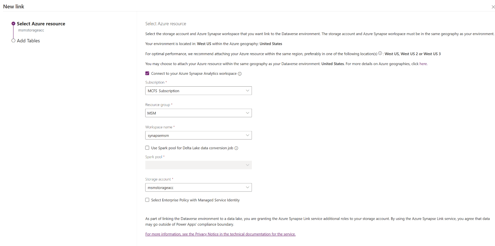
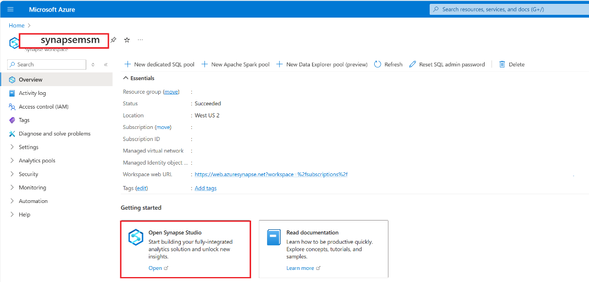
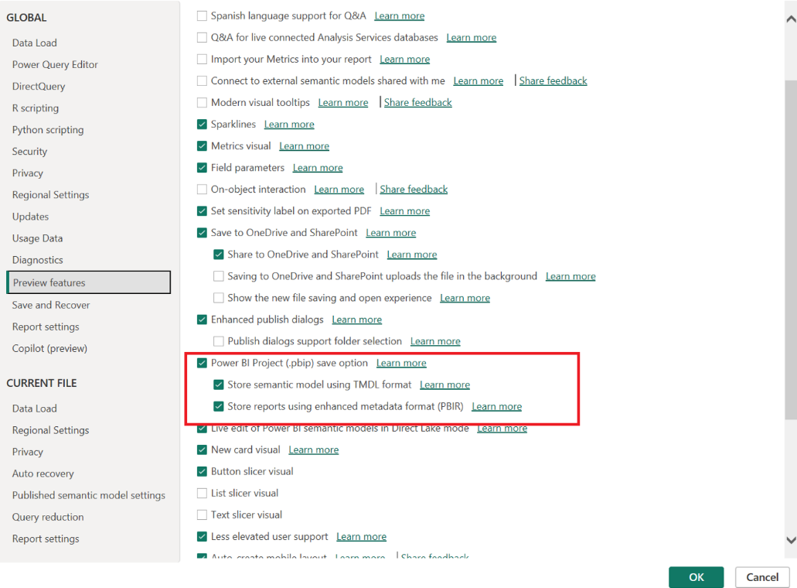
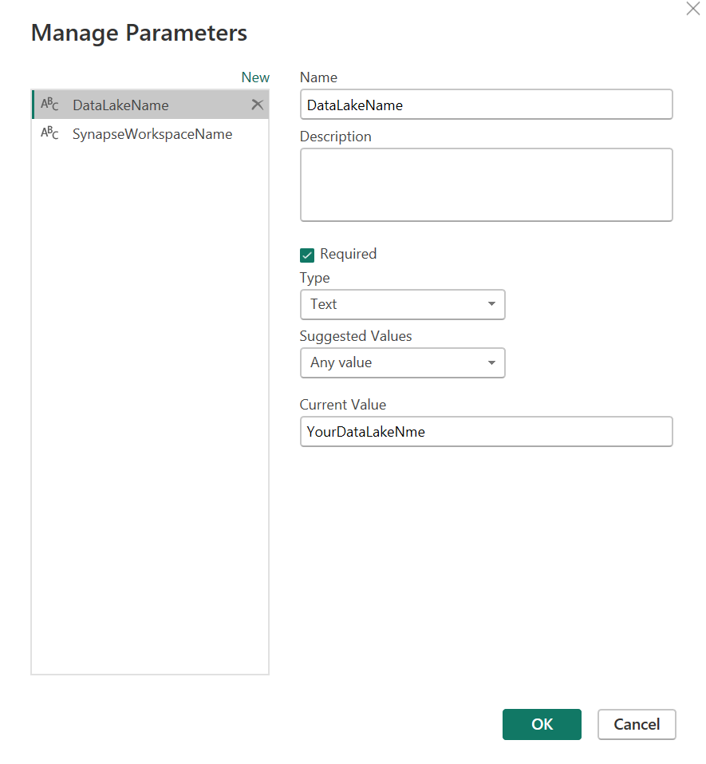

# Power BI semantic model accelerating custom reports

The pbix file provides a data model to speed up custom Power BI report
creation. For efficient data loading, use an Azure Synapse workspace,
especially for large datasets (500k+ records). After setting up the
Synapse workspace and link for your Microsoft Sustainability Manager
(MSM) dataverse, configure the parameters in the Power BI file and load
the data. This model uses standard MSM tables and columns, but you can
add custom ones to meet specific reporting needs.

## Steps to use Power BI dataset 

### Prerequisites to Connect Dataverse to Synapse workspace

<https://learn.microsoft.com/en-us/power-apps/maker/data-platform/azure-synapse-link-synapse#prerequisites>

1. Create ADLS Gen2 Storage account with hierarchical namespace
2. Create Synapse Workspace
    (<https://learn.microsoft.com/en-us/azure/synapse-analytics/get-started-create-workspace>
    )

### Connect Dataverse to Synapse workspace 

<https://learn.microsoft.com/en-us/power-apps/maker/data-platform/azure-synapse-link-synapse#connect-dataverse-to-synapse-workspace>

Navigate to make-powerapps.com and select Azure Synapse link on the left
menu

Setup a new synapse link with **Azure Synapse Analytics workspace**
enabled\

Choose the Sustainability Manager tables that you want to transform, and
then select **Next**.

  
Table | Logical name
--- | --- 
Accommodation type | msdyn_accommodationtype
Account | account
Accounting method | msdyn_accountingmethod
Allocation method | msdyn_allocationmethod
Allocation profile | msdyn_allocationprofile
Allocation result | msdyn_allocationresult
Alternate result basis | msdyn_alternateresultbasis
Business Travel | msdyn_businesstravel
Business travel type | msdyn_businesstraveltype
Capital good | msdyn_capitalgood
Circularity design principle | msdyn_circularitydesignprinciple
Contractual instrument type | msdyn_contractualinstrumenttype
Country/region | msdyn_countryregion
Country/region mapping | msdyn_countryregionmapping
Currency | transactioncurrency
Custom dimension metadata | msdyn_customdimensionmetadata
Disposal method | msdyn_disposalmethod
Emission | msdyn_emission
Employee Commuting | msdyn_employeecommuting
Employee commuting type | msdyn_employeecommutingtype
End-of-life treatment of sold products | msdyn_endoflifetreatmentofsoldproducts
Energy Source | msdyn_energysource
Facility | msdyn_facility
Facility item production | msdyn_facilityitemproduction
Facility type | msdyn_facilitytype
Fuel type | msdyn_fueltype
Fugitive emission | msdyn_fugitiveemission
General | msdyn_sustainabilitysetting
Greenhouse gas | msdyn_greenhousegas
Industrial process | msdyn_industrialprocess
Industrial process type | msdyn_industrialprocesstype
Item bill of materials | msdyn_itembillofmaterial
Item sustainable content | msdyn_itemsustainablecontent
Material | msdyn_material
Mobile combustion | msdyn_mobilecombustion
Monthly revenue | msdyn_organizationalunitrevenue
Organizational hierarchy | msdyn_sustainabilityorganizationalhierarchy
Organizational profile | msdyn_organizationalprofile
Organizational unit | msdyn_sustainabilityorganizationalunit
Product (sustainability) | msdyn_sustainabilityproduct
Product category | msdyn_productcategory
Purchased energy | msdyn_purchasedenergy
Purchased good and service | msdyn_purchasedgoodandservice
Report settings | msdyn*enablereport*sustainability
Reporting period | msdyn_reportingperiod
Reporting year | msdyn_reportingyear
Spend type | msdyn_spendtype
Stationary combustion | msdyn_stationarycombustion
Sustainability data definition | msdyn_sustainabilitydatadefinition
Sustainability data definition setting | msdyn_sustainabilitydatadefinitionsetting
Sustainability data definition subcategory | msdyn_sustainabilitydatadefinitionsubcategory
Sustainability item category SKU | msdyn_sustainabilityitemcategorysku
Sustainability item packaging | msdyn_sustainabilityitempackaging
Sustainability item SKU | msdyn_sustainabilityitemsku
Unit | msdyn_unit
Unit group | msdyn_unitgroup
Vehicle type | msdyn_vehicletype
Waste generated in operations | msdyn_wastegeneratedinoperations
Waste quality characteristic | msdyn_wastequalitycharacteristic
Waste quality test result | msdyn_wastequalitytestresult
Waste quantity | msdyn_wastequantity
Waste type | msdyn_wastetype
Water quality analysis | msdyn_waterqualityanalysis
Water quality characteristic | msdyn_waterqualitycharacteristic
Water quality test result | msdyn_waterqualitytestresult
Water quantity | msdyn_waterquantity
Water risk index | msdyn_waterriskindex
Water sample | msdyn_watersamplev2
Water source | msdyn_watersource
 |   

You can copy the Synapse Workspace name by opening it on Azure portal:\

And open the Synapse Studio to copy the data lake name as well.

Power BI setup

1. Power BI prerequisites

> Power BI Project should be enabled to be able to open the
> Dataset.pbix. File -\>Options and Settings -\>Options -\>Preview
> features\
> 

    The privacy level has to be changed as well to load the data.\
\

2. Setup your parameters and connect your Power BI dataset to the
    Synapse Workspace

    1. Open transform data and setup the parameters:\
        
        \
        Update the DatabaseLakeName and SynapseWorkspaceName:
    
    - **DataLakeName**: The datalake that has been generated by the Synapse
    link, starts with dataverse\_\
    

    - **SynapseWorkspaceName**: The Synapse Workspace you created as the first
    step

    > 

    2. **Save, Close & Apply** and load data into Power BI
